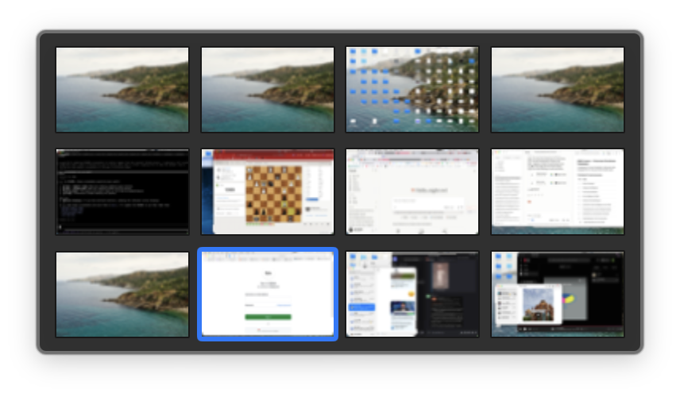
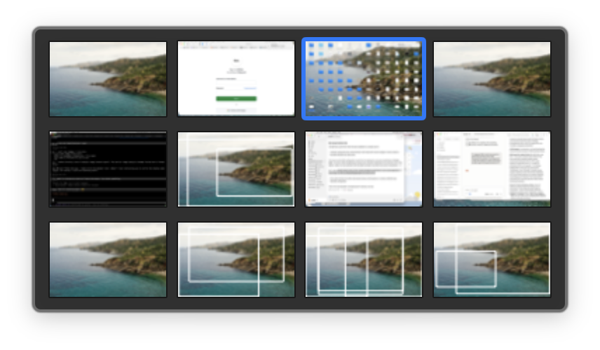
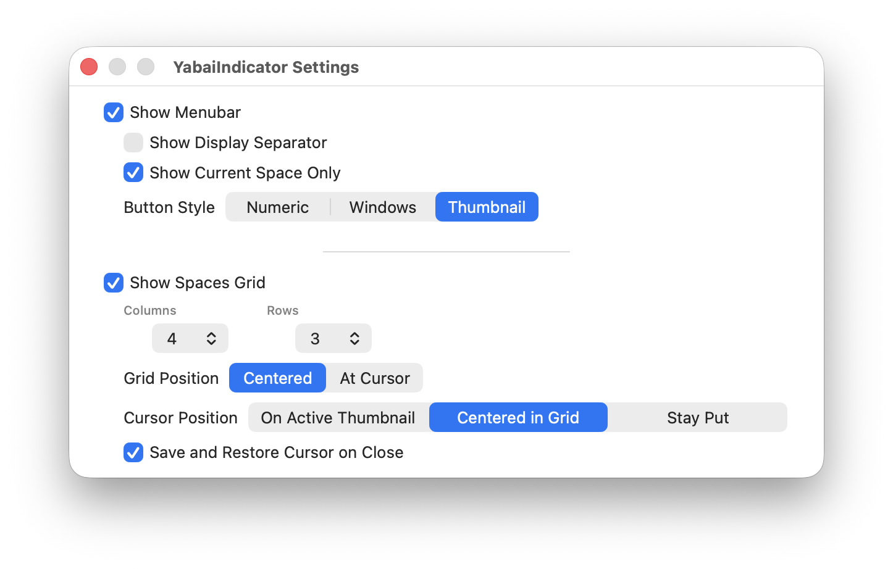

<div align="center">


# YabaiSpaces

**Clickable spaces switcher powered by Yabai**



Floating panel with window previews and keyboard navigation



Wireframe window outlines for unvisited spaces



Customizable panel layout and display options

</div>

## Features

- **Floating panel**: Shows all spaces with window previews and keyboard navigation
- **Wireframe previews**: Shows window outlines for unvisited spaces
- **Keyboard navigation**: Arrow keys, Enter, and Escape for quick space switching
- **Grid customization**: Configure columns (1-12) and rows (1-12) for the panel
- **Real thumbnails**: Captures and caches actual screen thumbnails for spaces
- **Multiple displays**: Separate spaces per display with optional divider
- **Global hotkey**: `Option+Command+Space` toggles the floating panel
- **Three-finger tap**: Right Shift tap shows the panel

## Requirements

[Yabai](https://github.com/koekeishiya/yabai) is required for space switching and keeping spaces in sync. Version 4.0.2+ required. SIP must be disabled for space switching to work correctly.

## Installation

Download the latest release from [Releases](https://github.com/carcot/YabaiSpaces/releases).

### Yabai Signals

Add these signals to your `.yabairc` to keep spaces and windows in sync:

```
yabai -m signal --add event=mission_control_exit action='echo "refresh" | nc -U /tmp/yabai-indicator.socket'
yabai -m signal --add event=display_added action='echo "refresh" | nc -U /tmp/yabai-indicator.socket'
yabai -m signal --add event=display_removed action='echo "refresh" | nc -U /tmp/yabai-indicator.socket'
yabai -m signal --add event=window_created action='echo "refresh windows" | nc -U /tmp/yabai-indicator.socket'
yabai -m signal --add event=window_destroyed action='echo "refresh windows" | nc -U /tmp/yabai-indicator.socket'
yabai -m signal --add event=window_focused action='echo "refresh windows" | nc -U /tmp/yabai-indicator.socket'
yabai -m signal --add event=window_moved action='echo "refresh windows" | nc -U /tmp/yabai-indicator.socket'
yabai -m signal --add event=window_resized action='echo "refresh windows" | nc -U /tmp/yabai-indicator.socket'
yabai -m signal --add event=window_minimized action='echo "refresh windows" | nc -U /tmp/yabai-indicator.socket'
yabai -m signal --add event=window_deminimized action='echo "refresh windows" | nc -U /tmp/yabai-indicator.socket'
```

If your keybinds modify spaces arrangement, send a refresh command:

```
echo "refresh" | nc -U /tmp/yabai-indicator.socket
```

## Settings

Access settings via:
- Menu bar: Right-click the indicator → "Preferences..."
- Panel: Right-click anywhere → "Preferences..."

**Menubar Options**
- Show/Hide Menubar
- Show Display Separator
- Show Current Space Only
- Button Style: Numeric | Windows | Thumbnail

**Spaces Grid Options**
- Show/Hide Spaces Grid
- Grid Position: Centered | At Cursor
- Cursor Position: On Active Thumbnail | Centered in Grid | Stay Put
- Save and Restore Cursor on Close
- Columns: 1-12
- Rows: 1-12

## Panel Navigation

When the panel is visible (`Option+Command+Space`):
- **Arrow keys**: Navigate between spaces (with wrap-around)
- **Enter/Space**: Switch to selected space
- **Escape**: Close panel
- **Click**: Switch to any space
- **Right-click**: Open context menu
- **Scroll/swipe**: Close panel

## Comparison to Similar Applications

[YabaiIndicator](https://github.com/xiamaz/YabaiIndicator) by Max Zhao - Excellent app with reliable space detection via SkyLight framework and Yabai integration. Serves as the foundation for this project. Huge thanks to Max for his great idea and creating such a solid base for this project.

[SpaceId](https://github.com/dshnkao/SpaceId) - More presentation configurability but no space switching. Doesn't use Yabai or Accessibility API.

[WhichSpace](https://github.com/gechr/WhichSpace) - Shows only the current active space. No all-spaces view or multi-display support.

## License

Based on [YabaiIndicator](https://github.com/xiamaz/YabaiIndicator) by Max Zhao.
